Aprendizaje Autom´atico y Miner´ıa de Datos: Proyecto Final

Ana Mart´ın S´anchez, Nicol´as Pastore Burgos

21/09/2021

> 1 Propuesta de proyecto
>
> Nuestro proyecto consiste en clasificar setas como comestibles o
> venenosas, dependiendo de un total de 20 atributos, como los
> siguientes:
>
> • Di´ametro del sombrero: un float que representa el di´ametro, en cm.
>
> • Forma del sombrero: un char que representa una de las posibles
> formas.
>
> • Superficie del sombrero: un char que representa el adjetivo que
> mejor describe la superficie del sombrero.
>
> Para poder analizar los datos, desplegamos algunos de estos atributos
> (los que eran de tipo enumerado) a matrices de booleanos. Despu´es de
> esta operaci´on, cada entrada de la base de datos ten´ıa 122
> atributos.
>
> La base de datos tiene un total de 61069 entradas. Por este motivo, no
> hemos utilizado todos los datos para el proyecto; para las pruebas, de
> manera general, hemos escogido un 20% de los datos para entrenar los
> sistemas, otro 20% para validarlos y otro 20% para hacer la prueba
> final.
>
> La base de datos original, extra´ıda de la plataforma , ten´ıa los
> datos organizados de manera que escoger una muestra en el orden
> establecido no era ´util. Por esta raz´on, decidimos utilizar los
> datos seg´un estaban organizados en , ya que estaban mezclados.
>
> Para entender mejor los datos, presentamos una serie de gr´aficos que
> permiten hacer comparaciones entre las setas comestibles y las
> venenosas:

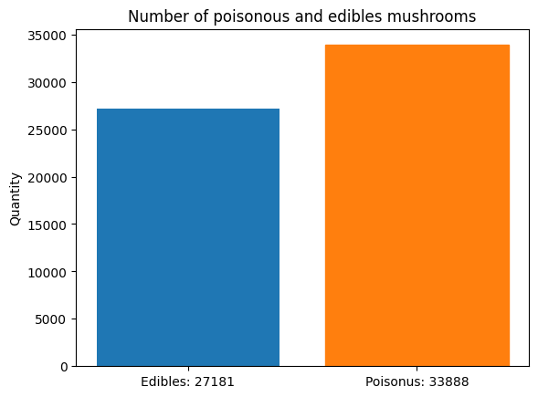

> Como se puede observar, la cantidad de muestras de setas venenosas
> supera en n´umero a la de setas comestibles, en m´as de 6000 entradas.

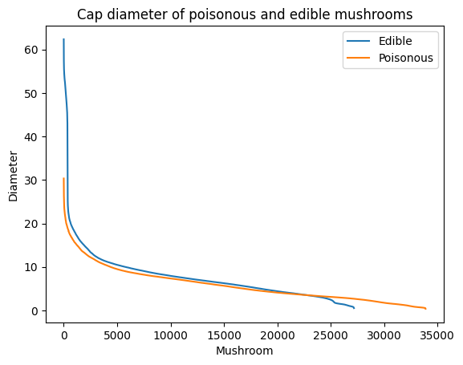

> Nos pareci´o interesante mostrar c´omo, cuando el di´ametro del
> sombrero de las setas es muy grande, es muy probable que las setas
> sean comestibles. Sin embargo, en tama˜nos intermedios, resulta m´as
> dif´ıcil diferenciar las setas comestibles de las venenosas.

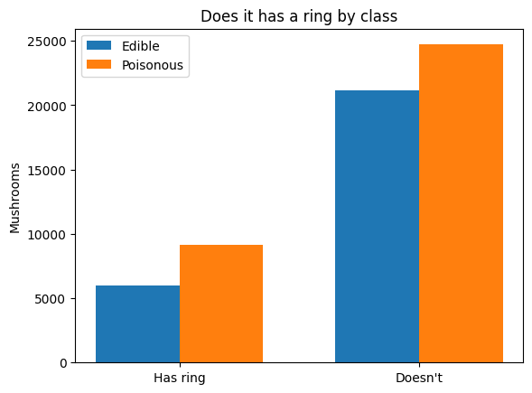

> En este caso, vemos que la mayor´ıa de las setas no tienen anillo.
> Hemos escogido esta gr´afica como muestra de algunos de los valores
> binarios que se van a analizar m´as adelante.

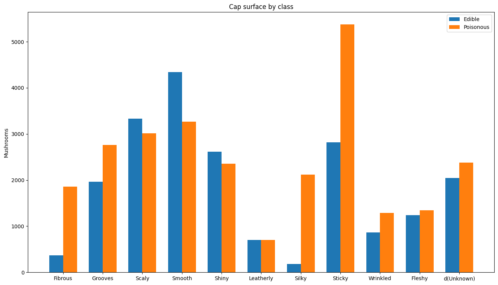

> Por ´ultimo, se muestran una serie de adjetivos que describen m´as
> fiablemente el tipo de superficie del sombrero, y cu´ales son
> venenosas y comestibles. Como se puede ver, y como comentamos a
> continuaci´on, muchas de las entradas ten´ıan un valor "d" para esta
> caracter´ıstica (un valor desconocido).

> 1.1 Problemas encontrados
>
> Al analizar los datos, nos dimos cuenta de que la base de datos nos
> supondr´ıa algunos problemas para realizar el proyecto:\
> En primer lugar, hay columnas en las que todos los valores son 0.
> Tambi´en se dio que, en la gran mayor´ıa de filas, alguna de las
> columnas no ten´ıa un valor.
>
> Por otra parte, algunos de los datos eran contradictorios. En
> concreto, algunas de las entradas ten´ıan marcado como "t" la columna
> de has-ring (lo que significa que, efectivamente, tienen un anillo);
> pero, posteriormente, en la columna de ring-type, ten´ıan marcado "f"
> (que se corresponde con el tipo "ninguno"). Esto no supone un problema
> a la hora de implementar los sistemas de aprendizaje autom´atico, pero
> s´ı son un problema desde el punto de vista sem´antico, y nos hacen
> dudar de la validez de los datos.

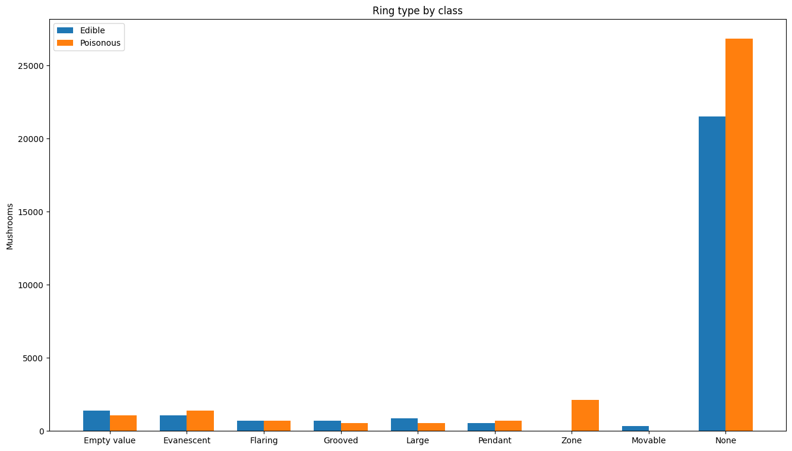

> Por ´ultimo, encontramos un problema con la correlaci´on entre los
> datos y la salida. Como se puede observar en las siguientes gr´aficas,
> ninguna de las entradas tiene una correlaci´on que supere el 0.2, ni
> en el eje positivo ni en el negativo.

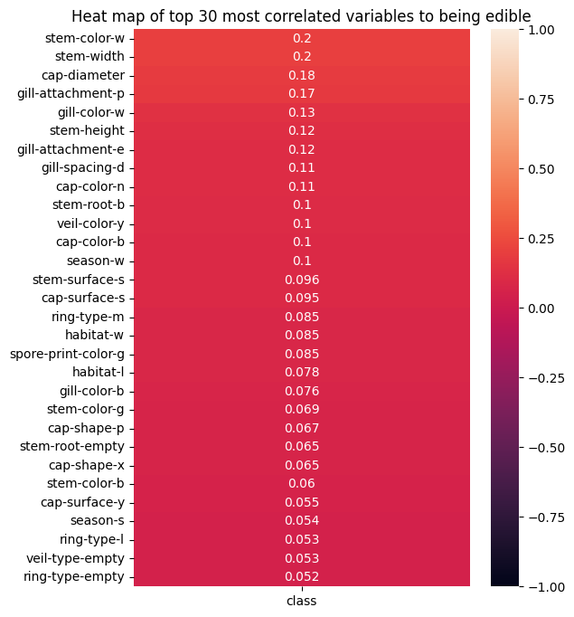

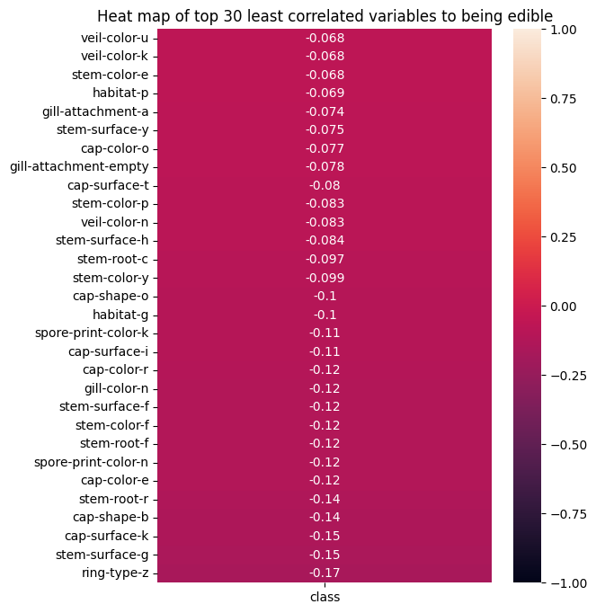

> 2 Resultados obtenidos
>
> Para obtener los mejores resultados posibles, hemos utilizado varios
> m´etodos de los estudiados en clase, a fin de poder compararlos.
>
> 2.1 Regresi´on Log´ıstica
>
> La regresi´on log´ıstica se puede entender como un caso especial de la
> regresi´on lineal, en la que la variable dependiente puede tomar dos
> valores: 0 o 1. Se emplea para calcular probabilidades (ya que los
> valores obtenidos estar´an entre 0 y 1), o para clasificar eventos en
> dos categor´ıas; en este caso, se puede utilizar para calcular la
> probabilidad de que una seta sea comestible (o, dicho de otra manera,
> para clasificar una seta como comestible o venenosa).
>
> Para utilizar este m´etodo, implementamos la funci´on de gradiente, de
> coste y la funci´on sigmoide como hemos visto en clase, y obtuvimos
> una tasa de aciertos del 97.14262%, con un coste de 0.12467. Para
> llegar a estos resultados, utilizamos un valor para lambda = 3.0 y un
> exponente = 2.
>
> 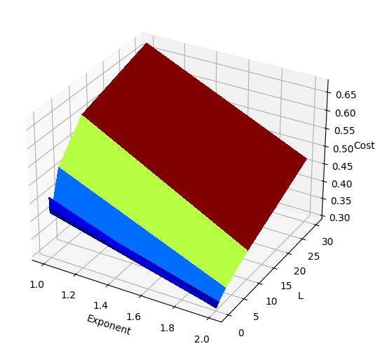
>
> 2.2 Redes Neuronales
>
> 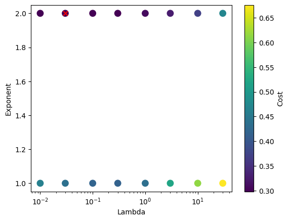
>
> Se entiende como red neuronal a un conjunto de capas ocultas, una capa
> de entrada y una capa de salida que intentan imitar el funcionamiento
> del cerebro humano. Cada nodo de las capas (el que equivaldr´ıa a una
> "neurona artificial"), se conecta a otros, y tiene un peso y umbral
> asociados. Si el valor de un nodo supera su umbral, la "neurona"se
> activa y env´ıa los datos a la siguiente capa de la red.
>
> Tras probar con varias configuraciones para la red neuronal, llegamos
> a un porcentaje de aciertos del 99.828%, con un coste de 0.0025. Para
> ello, utilizamos una red neuronal con dos capas ocultas (la primera,
> con 60 nodos; y la segunda, con 40), y una constante de
> regularizaci´on de 0.3. El algoritmo dio 1000 vueltas para llegar a
> este resultado.

> 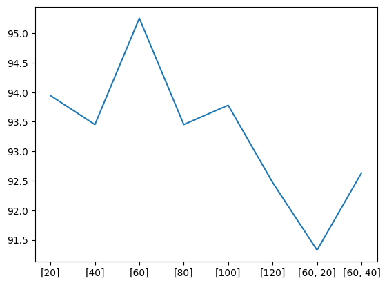
>
> 2.3 SVM
>
> Una M´aquina de Vectores de Soporte (o SVM, por sus siglas en
> ingl´es), es un conjunto de algoritmos relacionados con problmas de
> clasificaci´on y regresi´on. Una SVM intenta construir un hiperplano
> de un espacio N-dimensional que consiga clasificar los datos
> correctamente (donde N es el n´umero de caracter´ısticas que se
> proporcionan).
>
> Nuestro mejor resultado se corresponde, entonces, con la segunda
> entrada de la tabla: un 99.984% de aciertos con un valor de C = 3.0 y
> un valor de sigma = 3.0, y reduciendo en casi 30 minutos el tiempo
> necesario para analizar los datos.

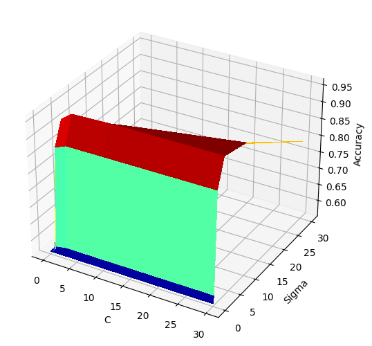

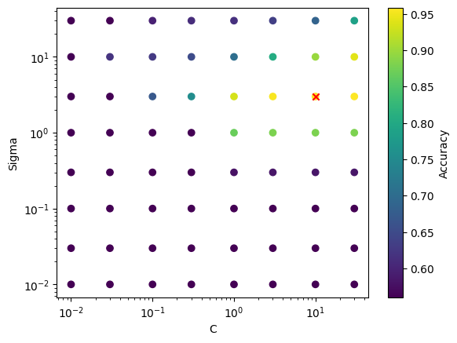

> 3 Conclusiones
>
> Para calcular los algoritmos, utilizamos en todos los casos unos
> datasets con las siguientes caracter´ısticas:
>
> • Tama˜no de la muestra de entrenamiento: 12213 entradas
>
> • Tama˜no de la muestra de validaci´on: 12213 entradas
>
> • Tama˜no de la muestra de testeo: 12213 entradas
>
> • En todos los casos, las muestras son diferentes entre s´ı.
>
> Tras realizar todas las pruebas, obtuvimos los siguientes resultados:

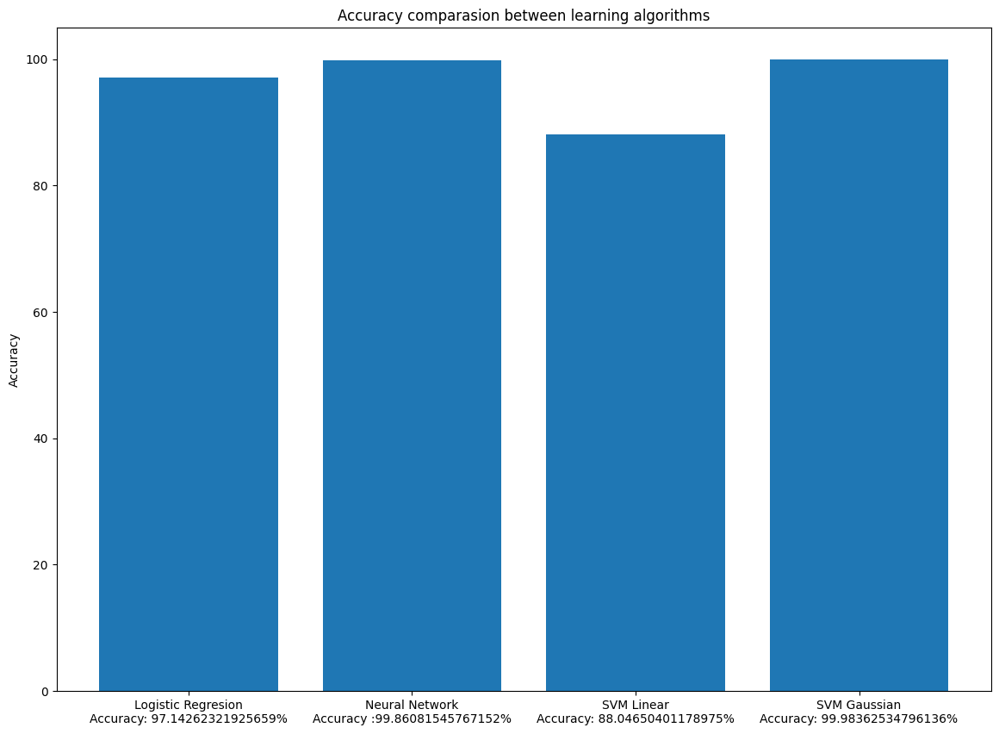

